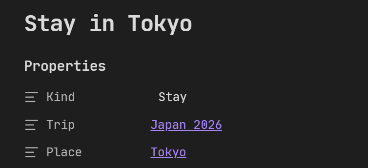
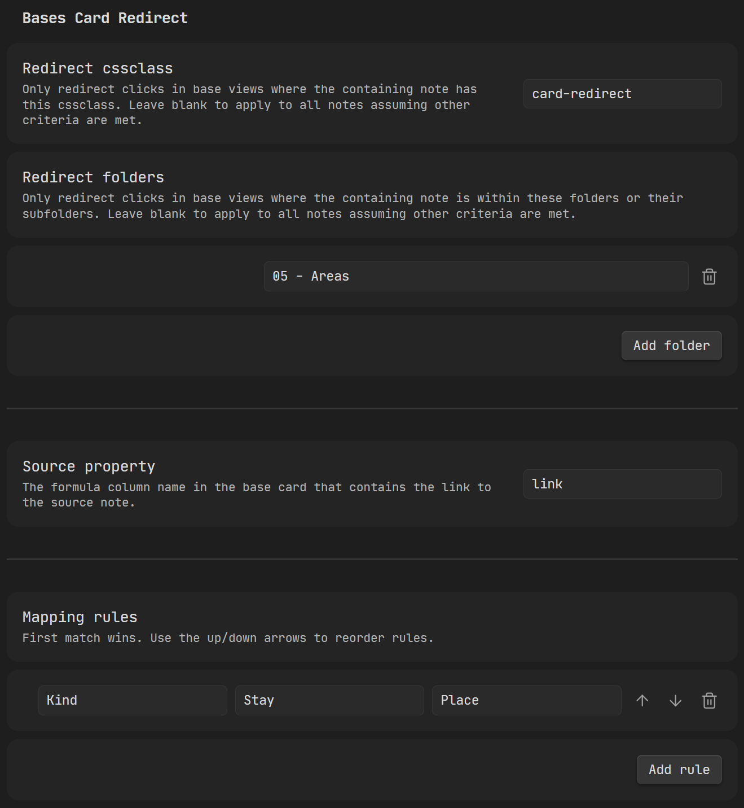

# Bases Card Redirect

I recently started building a travel planner in Obsidian and hit a wall with Bases card view. I wanted graphical representations of my itinerary notes that linked through to my destination notes, but Bases doesn't have SQL join-like behaviour. There are some workarounds in table view, but I couldn't find a way to have itinerary items as cards that click through to the related place note. This plugin is my attempt to enable that in a simple, lightweight way.

For example, say you're planning a trip: Tokyo -> Kyoto -> Osaka -> Tokyo. Your card view might show two Tokyo entries, one for each stay, and clicking either one should take you to the Tokyo place note rather than the individual itinerary note. That's exactly what this does.

It doesn't have to be travel either. Any vault with a one-to-many relationship between note types can make use of it.

## How it works

When you click a card in Bases card view, the plugin checks the source note's frontmatter against your defined rules. Each rule specifies a property to match on, the value to match, and a target property whose value is the note to redirect to. The first matching rule wins.

For example, a note with the following frontmatter and a rule set to match `Kind = Stay` would redirect to the `Place` note, in this case Tokyo.

You can scope redirects to specific notes using a cssclass, or limit them to notes within certain folders, so the plugin only fires where you want it to.

Modifier keys are preserved. ctrl/cmd opens in a new tab, ctrl/cmd + alt opens in a split, and middle click behaves as expected.

## Setup

### Installation

1. Go to the [latest release](https://github.com/maxpower24/bases-card-redirect/releases/latest)
2. Download `main.js` and `manifest.json`
3. In your vault, create the folder `.obsidian/plugins/bases-card-redirect/`
4. Copy both files into that folder
5. Open Obsidian, go to Settings -> Community plugins and enable Bases Card Redirect

### Configuration

1. Go to Settings -> Bases Card Redirect
2. Optionally set a **Redirect cssclass** -- only notes with this cssclass in their frontmatter will trigger redirects
3. Optionally add **Redirect folders** -- limits redirects to base views within these folders
4. Set the **Source property** -- the formula column in your base that contains a link to the source note
5. Add your **Mapping rules** -- each rule defines a property to match, the value to match, and the target property to redirect to

## Screenshot

